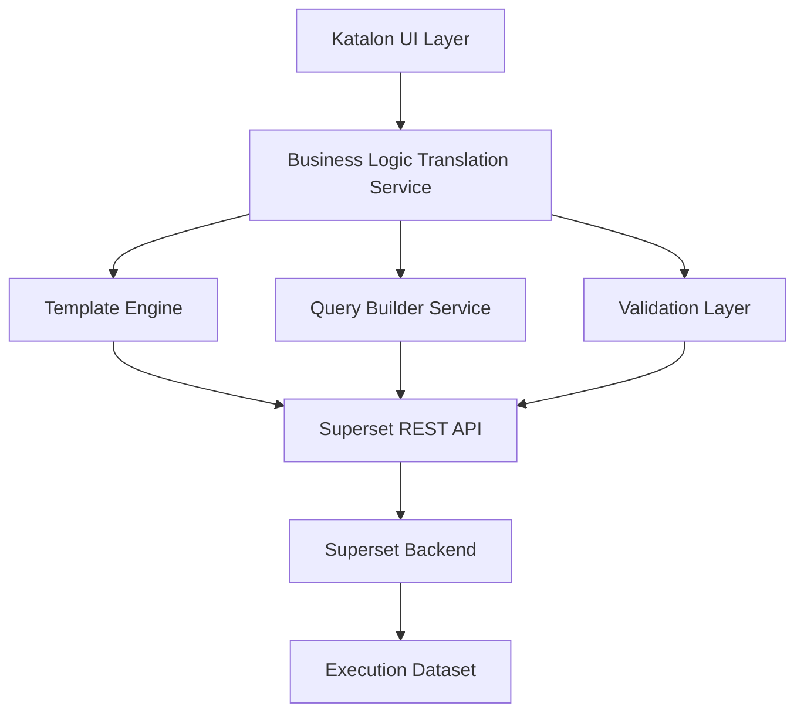

# Technical Implementation Roadmap: Superset Abstraction Layer

## Architecture Overview



---

## 1. Translation Service Architecture

### 1.1 Core Translation Engine
```typescript
interface BusinessConfig {
  useCase: string;
  timeRange: TimeRange;
  projects: string[];
  metrics: BusinessMetric[];
  groupBy: string[];
  filters: BusinessFilter[];
}

interface SupersetConfig {
  dataset: string;
  chart_type: string;
  metrics: MetricConfig[];
  groupby: string[];
  adhoc_filters: FilterConfig[];
  time_range: string;
}

class ConfigTranslator {
  translate(business: BusinessConfig): SupersetConfig {
    const template = this.getTemplate(business.useCase);
    return {
      dataset: template.dataset,
      chart_type: template.chartType,
      metrics: this.translateMetrics(business.metrics, template),
      groupby: this.translateDimensions(business.groupBy, template),
      adhoc_filters: this.translateFilters(business.filters, template),
      time_range: this.translateTimeRange(business.timeRange)
    };
  }
}
```

### 1.2 Template System
```yaml
# Performance Analysis Template
performance_analysis:
  superset_config:
    chart_type: "line"
    dataset: "execution_dataset"
    default_metrics:
      - metric: "avg_duration"
        superset: "AVG(duration)"
        label: "Average Test Duration"
      - metric: "test_count" 
        superset: "COUNT(*)"
        label: "Number of Tests"
    default_dimensions:
      - business: "test_type"
        superset: "test_type"
        label: "Manual vs Automated"
      - business: "daily"
        superset: "DATE_TRUNC('day', start_time)"
        label: "Daily Breakdown"
    default_filters:
      - business: "last_30_days"
        superset: 
          col: "start_time"
          op: ">="
          val: "{{ get_date_offset(-30) }}"
```

---

## 2. Feature-by-Feature Implementation Strategy

### 2.1 Dataset Selection Abstraction
```typescript
// Hide Superset's dataset selector entirely
interface DatasetService {
  getBusinessDatasets(): BusinessDataset[] {
    return [
      {
        id: "test_executions",
        name: "Test Execution Results",
        description: "All test run data including manual and automated tests",
        lastUpdated: "5 minutes ago",
        recordCount: "~1.2M executions",
        superset_dataset: "kit_objs.execution"
      }
    ];
  }
}

// Auto-select based on use case
class UseCaseRouter {
  getDatasetForUseCase(useCase: string): string {
    const mapping = {
      "performance_analysis": "test_executions",
      "quality_trends": "test_executions", 
      "team_productivity": "test_executions",
      "release_readiness": "test_executions"
    };
    return mapping[useCase];
  }
}
```

### 2.2 Chart Type Simplification
```typescript
interface ChartTypeService {
  getChartsForUseCase(useCase: string): ChartOption[] {
    const templates = {
      "performance_analysis": [
        {
          id: "duration_trend",
          name: "Duration Over Time",
          description: "See how test execution time changes",
          chartType: "mixed_timeseries",
          preview: "📈 Line chart with time axis"
        },
        {
          id: "type_comparison", 
          name: "Manual vs Automated Comparison",
          chartType: "bar",
          preview: "📊 Side-by-side bars"
        }
      ]
    };
    return templates[useCase] || [];
  }
}
```

### 2.3 Metrics Translation Layer
```typescript
class MetricsTranslator {
  businessMetrics = {
    // Performance metrics
    "avg_test_duration": {
      superset: "AVG(duration)",
      label: "Average Test Duration",
      unit: "seconds",
      description: "Mean time for test execution"
    },
    "test_throughput": {
      superset: "COUNT(*) / (MAX(start_time) - MIN(start_time))",
      label: "Tests Per Hour", 
      unit: "tests/hour",
      description: "Test execution velocity"
    },
    
    // Quality metrics
    "pass_rate": {
      superset: "SUM(CASE WHEN status='PASSED' THEN 1 ELSE 0 END) * 100.0 / COUNT(*)",
      label: "Test Pass Rate",
      unit: "percentage",
      description: "Percentage of tests that passed"
    },
    "flakiness_score": {
      superset: "CUSTOM_FLAKINESS_CALCULATION(session_id, status)",
      label: "Test Stability Score",
      unit: "score",
      description: "Higher score = more stable tests"
    },
    
    // Productivity metrics  
    "automation_coverage": {
      superset: "SUM(CASE WHEN test_type='automated' THEN 1 ELSE 0 END) * 100.0 / COUNT(*)",
      label: "Automation Coverage",
      unit: "percentage",
      description: "Percentage of tests that are automated"
    }
  };
}
```

### 2.4 Filter System Abstraction
```typescript
class FilterTranslator {
  translateBusinessFilter(filter: BusinessFilter): SupersetFilter {
    const translations = {
      "last_7_days": {
        col: "start_time",
        op: ">=",
        val: "{{ get_date_offset(-7) }}"
      },
      "only_passed_tests": {
        col: "status", 
        op: "==",
        val: "PASSED"
      },
      "exclude_flaky_tests": {
        col: "flakiness_score",
        op: ">",
        val: 0.8
      },
      "my_projects": {
        col: "project_id",
        op: "IN",
        val: "{{ get_user_projects() }}"
      }
    };
    
    return translations[filter.type];
  }
}
```

---

## 3. UI Component Implementation

### 3.1 Use Case Selector Component
```jsx
const UseCaseSelector = () => {
  const useCases = [
    {
      id: 'performance',
      icon: '⚡',
      title: 'Test Performance Analysis',
      description: 'Compare execution times and identify bottlenecks',
      businessValue: 'ROI Impact',
      persona: 'QA Managers'
    }
    // ... other use cases
  ];

  return (
    <div className="use-case-grid">
      {useCases.map(useCase => (
        <UseCaseCard 
          key={useCase.id}
          {...useCase}
          onClick={() => handleSelection(useCase.id)}
        />
      ))}
    </div>
  );
};
```

### 3.2 Business Configuration Form
```jsx
const BusinessConfigForm = ({ useCase }) => {
  const template = useTemplate(useCase);
  
  return (
    <Form>
      <TimeRangeSelector 
        defaultValue="last_30_days"
        options={['last_7_days', 'last_30_days', 'last_3_months']}
      />
      
      <ProjectSelector
        label="Which projects to include?"
        multiple
        defaultValue="all"
      />
      
      <MetricSelector
        label="Primary performance metric"
        options={template.availableMetrics}
        defaultValue={template.defaultMetric}
      />
      
      <GroupBySelector
        label="Group results by"
        options={['daily', 'weekly', 'test_type', 'project']}
      />
    </Form>
  );
};
```

### 3.3 Live Preview Component
```jsx
const LivePreview = ({ config }) => {
  const [chartData, setChartData] = useState(null);
  const [loading, setLoading] = useState(false);

  useEffect(() => {
    if (config.isValid) {
      setLoading(true);
      generatePreview(config)
        .then(setChartData)
        .finally(() => setLoading(false));
    }
  }, [config]);

  return (
    <div className="preview-panel">
      <h3>Live Preview</h3>
      {loading ? (
        <ChartSkeleton />
      ) : chartData ? (
        <MiniChart data={chartData} />
      ) : (
        <EmptyState />
      )}
      
      <PreviewInfo 
        dataPoints={chartData?.metadata?.rowCount}
        estimatedLoadTime={chartData?.metadata?.loadTime}
        chartType={config.chartType}
      />
    </div>
  );
};
```

---

## 4. Backend Service Implementation

### 4.1 Superset API Wrapper
```python
class KatalonSupersetService:
    def __init__(self, superset_client):
        self.client = superset_client
        self.translator = ConfigTranslator()
        
    def create_chart_from_business_config(self, business_config):
        # Translate business config to Superset format
        superset_config = self.translator.translate(business_config)
        
        # Create chart via Superset API
        chart_response = self.client.post('/api/v1/chart/', {
            'slice_name': business_config.widget_name,
            'datasource_id': self.get_dataset_id(superset_config.dataset),
            'datasource_type': 'table',
            'params': json.dumps(superset_config.params),
            'viz_type': superset_config.chart_type
        })
        
        # Store business metadata for later editing
        self.store_business_metadata(chart_response.id, business_config)
        
        return chart_response
        
    def get_chart_preview_data(self, business_config, limit=100):
        superset_config = self.translator.translate(business_config)
        
        # Generate preview query
        preview_response = self.client.post('/api/v1/chart/data', {
            'datasource': {
                'id': self.get_dataset_id(superset_config.dataset),
                'type': 'table'
            },
            'queries': [{
                'metrics': superset_config.metrics,
                'groupby': superset_config.groupby,
                'filters': superset_config.adhoc_filters,
                'row_limit': limit,
                'time_range': superset_config.time_range
            }]
        })
        
        return self.format_preview_data(preview_response)
```

### 4.2 Validation Service
```python
class BusinessConfigValidator:
    def validate(self, config):
        errors = []
        warnings = []
        
        # Validate time range makes sense
        if config.time_range == 'custom':
            if not config.start_date or not config.end_date:
                errors.append("Custom time range requires start and end dates")
        
        # Validate metric combinations
        if len(config.metrics) > 5:
            warnings.append("Too many metrics may make chart hard to read")
            
        # Validate data availability
        estimated_rows = self.estimate_data_volume(config)
        if estimated_rows > 100000:
            warnings.append(f"Large dataset ({estimated_rows:,} rows) may load slowly")
        elif estimated_rows < 10:
            warnings.append("Very few data points - consider expanding time range")
            
        return ValidationResult(errors, warnings)
```

---

## 5. Progressive Disclosure Implementation

### 5.1 User Skill Level Detection
```typescript
class UserSkillAssessment {
  assessSkill(userId: string): SkillLevel {
    const metrics = {
      chartsCreated: this.getChartsCreated(userId),
      advancedFeaturesUsed: this.getAdvancedFeatureUsage(userId),
      sqlQueriesWritten: this.getSqlQueryCount(userId),
      timeSpentInApp: this.getTotalTimeSpent(userId)
    };
    
    if (metrics.sqlQueriesWritten > 0 || metrics.advancedFeaturesUsed > 5) {
      return 'ADVANCED';
    } else if (metrics.chartsCreated > 10) {
      return 'INTERMEDIATE';  
    } else {
      return 'BEGINNER';
    }
  }
  
  getUIConfigForSkill(skillLevel: SkillLevel): UIConfig {
    return {
      'BEGINNER': {
        showAdvancedOptions: false,
        showSqlEditor: false,
        maxChartTypes: 5,
        showBusinessLanguageOnly: true
      },
      'INTERMEDIATE': {
        showAdvancedOptions: true,
        showSqlEditor: false, 
        maxChartTypes: 15,
        showBusinessLanguageOnly: false
      },
      'ADVANCED': {
        showAdvancedOptions: true,
        showSqlEditor: true,
        maxChartTypes: -1, // all
        showBusinessLanguageOnly: false
      }
    }[skillLevel];
  }
}
```

### 5.2 Contextual Help System
```jsx
const ContextualHelp = ({ context, userLevel }) => {
  const helpContent = {
    'metric_selection': {
      'BEGINNER': {
        title: "Choose What to Measure",
        content: "Pick the main thing you want to track, like how long tests take or how many pass.",
        examples: ["Average test duration", "Test pass rate"]
      },
      'ADVANCED': {
        title: "Metric Configuration", 
        content: "Select metrics to aggregate. Complex calculations available in SQL mode.",
        examples: ["AVG(duration)", "Custom calculated fields"]
      }
    }
  };
  
  const content = helpContent[context][userLevel];
  
  return (
    <HelpTooltip>
      <h4>{content.title}</h4>
      <p>{content.content}</p>
      {content.examples && (
        <ul>
          {content.examples.map(example => <li key={example}>{example}</li>)}
        </ul>
      )}
    </HelpTooltip>
  );
};
```

---

## 6. Integration with Existing Katalon Ecosystem

### 6.1 Dashboard Integration
```typescript
class KatalonDashboardIntegration {
  addWidgetToDashboard(dashboardId: string, widgetConfig: BusinessConfig) {
    // Create chart in Superset
    const chart = this.supersetService.createChart(widgetConfig);
    
    // Add to Katalon dashboard system
    return this.katalon.dashboards.addWidget(dashboardId, {
      type: 'superset_chart',
      chartId: chart.id,
      title: widgetConfig.title,
      size: this.calculateOptimalSize(widgetConfig.chartType),
      position: this.findBestPosition(dashboardId)
    });
  }
  
  syncWithProjectData(projectId: string) {
    // Ensure widget filters are scoped to current project
    const widgets = this.getProjectWidgets(projectId);
    
    widgets.forEach(widget => {
      const config = this.getBusinessConfig(widget.id);
      config.filters.push({
        type: 'project_scope',
        value: projectId
      });
      this.updateWidget(widget.id, config);
    });
  }
}
```

### 6.2 Authentication and Permissions
```python
class KatalonAuthIntegration:
    def __init__(self, katalon_auth, superset_security):
        self.katalon_auth = katalon_auth
        self.superset_security = superset_security
        
    def create_superset_session(self, katalon_user_token):
        # Validate Katalon token
        user_info = self.katalon_auth.validate_token(katalon_user_token)
        
        # Create corresponding Superset session
        superset_token = self.superset_security.create_session({
            'user_id': user_info.id,
            'roles': self.map_katalon_roles_to_superset(user_info.roles),
            'permissions': self.get_data_permissions(user_info.projects)
        })
        
        return superset_token
        
    def map_katalon_roles_to_superset(self, katalon_roles):
        role_mapping = {
            'qa_director': ['Gamma', 'Dashboard_Creator'],
            'qa_manager': ['Gamma', 'Chart_Creator'], 
            'tester': ['Gamma', 'Chart_Viewer']
        }
        
        superset_roles = []
        for role in katalon_roles:
            superset_roles.extend(role_mapping.get(role, ['Gamma']))
            
        return list(set(superset_roles))
```

---

## 7. Testing and Quality Assurance Strategy

### 7.1 Translation Accuracy Testing
```python
class TranslationAccuracyTests:
    def test_metric_translation_correctness(self):
        business_config = BusinessConfig(
            metrics=['pass_rate', 'avg_duration'],
            time_range='last_30_days'
        )
        
        superset_config = self.translator.translate(business_config)
        
        # Verify SQL generation
        expected_sql = """
        SELECT 
          SUM(CASE WHEN status='PASSED' THEN 1 ELSE 0 END) * 100.0 / COUNT(*) as pass_rate,
          AVG(duration) as avg_duration
        FROM execution_dataset 
        WHERE start_time >= NOW() - INTERVAL 30 DAY
        """
        
        self.assertSQLEquivalent(superset_config.query, expected_sql)
        
    def test_filter_translation_accuracy(self):
        # Test various filter combinations
        filter_tests = [
            ('last_7_days', "start_time >= NOW() - INTERVAL 7 DAY"),
            ('only_passed_tests', "status = 'PASSED'"),
            ('my_projects', "project_id IN (SELECT id FROM user_projects WHERE user_id = ?)")
        ]
        
        for business_filter, expected_sql in filter_tests:
            config = BusinessConfig(filters=[business_filter])
            result = self.translator.translate(config)
            self.assertIn(expected_sql, result.filters)
```

### 7.2 User Experience Testing
```python
class UXTestSuite:
    def test_use_case_completion_flow(self):
        # Test complete user journey from use case selection to widget creation
        flow = [
            self.select_use_case('performance_analysis'),
            self.configure_time_range('last_30_days'),
            self.select_projects(['mobile_app']),
            self.choose_primary_metric('avg_duration'),
            self.preview_chart(),
            self.save_widget('My Performance Widget')
        ]
        
        self.assertFlowCompletes(flow, expected_duration_seconds=180)
        
    def test_error_handling_clarity(self):
        # Test that errors are business-friendly
        invalid_config = BusinessConfig(
            time_range='custom',
            start_date=None,  # This should trigger validation error
            end_date=None
        )
        
        errors = self.validator.validate(invalid_config)
        
        # Error should be in business language, not technical
        self.assertIn("Please select start and end dates", errors.messages)
        self.assertNotIn("NULL constraint violation", errors.messages)
```

---

## 8. Performance Optimization Strategy

### 8.1 Query Performance
```python
class PerformanceOptimizer:
    def optimize_business_query(self, config: BusinessConfig) -> OptimizedQuery:
        # Add performance hints based on business use case
        optimizations = []
        
        if config.use_case == 'performance_analysis':
            # Pre-aggregate duration metrics
            optimizations.append('USE_DURATION_MATERIALIZED_VIEW')
            
        if config.time_range in ['last_7_days', 'last_30_days']:
            # Use time-partitioned tables
            optimizations.append('PARTITION_PRUNING')
            
        if len(config.projects) == 1:
            # Project-specific index utilization
            optimizations.append('PROJECT_INDEX_HINT')
            
        return self.apply_optimizations(config, optimizations)
```

### 8.2 Caching Strategy
```python
class BusinessQueryCache:
    def get_cache_key(self, config: BusinessConfig) -> str:
        # Create cache key from business config
        key_components = [
            config.use_case,
            config.time_range,
            sorted(config.projects),
            sorted(config.metrics),
            config.filters_hash()
        ]
        return hashlib.md5(json.dumps(key_components).encode()).hexdigest()
        
    def should_cache(self, config: BusinessConfig) -> bool:
        # Cache common business patterns
        common_patterns = [
            'last_30_days_performance',
            'weekly_quality_trends', 
            'project_comparison_dashboard'
        ]
        
        pattern = f"{config.time_range}_{config.use_case}"
        return pattern in common_patterns
```

This implementation roadmap provides a concrete technical foundation for abstracting Superset's complexity while maintaining its power for QA team use cases.